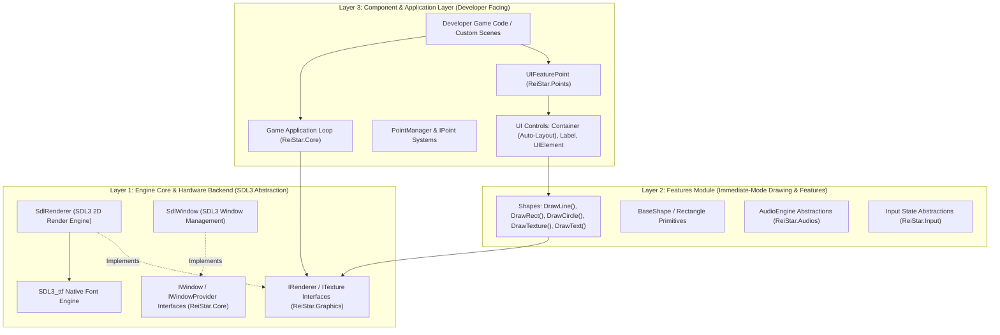

# OpenReiStar (C#)

**OpenReiStar** is a modern, modular 2D C# game engine framework built on **.NET 10.0** and **SDL3** (`ppy.SDL3-CS` & `ppy.SDL3_ttf-CS`).

Designed around a strict, decoupled **3-Layer Architecture**, OpenReiStar isolates hardware backend abstractions from feature drawing APIs and high-level developer UI/game components.

---

## 🏗️ 3-Layer Architecture Diagram



---

## 🧩 Architectural Breakdown

### 🔹 Layer 1: Engine Core & Hardware Backend
* **Projects:** `ReiStar.Core`, `ReiStar.Graphics`, `ReiStar.Renderer.SDL3`
* **Purpose:** Abstract native SDL3 platform APIs into clean, pure C# interfaces.
* **Key Responsibilities:**
  * **[`IRenderer`](file:///E:/ProjectTemp-Server/OpenReiStar-cs/ReiStar.Graphics/IRenderer.cs):** Backend-agnostic drawing contract for rectangles, outlines, lines, circles, textures, and text.
  * **[`SdlRenderer`](file:///E:/ProjectTemp-Server/OpenReiStar-cs/ReiStar.Renderer.SDL3/SdlRenderer.cs):** Native SDL3 2D batching renderer leveraging `SDL_RenderGeometry` for texture quads.
  * **[`SdlWindow`](file:///E:/ProjectTemp-Server/OpenReiStar-cs/ReiStar.Renderer.SDL3/SdlWindow.cs):** Window creation, event polling, and lifecycle management with instance reference counting.
  * **[`Font`](file:///E:/ProjectTemp-Server/OpenReiStar-cs/ReiStar.Graphics/Font.cs):** Native `SDL3_ttf` TrueType font management with point-size quantizing (0.5pt) and LRU handle caching.

---

### 🔸 Layer 2: Features Module
* **Projects:** `ReiStar.Shapes`, `ReiStar.Audios`, `ReiStar.Input`
* **Purpose:** Convert low-level backend abstractions into powerful, immediate-mode drawing features.
* **Key Responsibilities:**
  * **[`Shapes`](file:///E:/ProjectTemp-Server/OpenReiStar-cs/ReiStar.Shapes/Shapes.cs):** High-level static immediate-mode API providing `DrawLine()`, `DrawRect()`, `DrawCircle()`, `DrawTexture()`, and `DrawText()`.
  * **Responsive Positioning:** Integrates `UVect` (scale + offset coordinates) and `Anchor` alignment for screen-resolution-independent rendering.

---

### 🔹 Layer 3: Component & Application Layer
* **Projects:** `ReiStar.Points`, `ReiStar.SampleGame`
* **Purpose:** Interchangeable, developer-facing component layer for building game scenes and user interfaces.
* **Key Responsibilities:**
  * **[`UIFeaturePoint`](file:///E:/ProjectTemp-Server/OpenReiStar-cs/ReiStar.Points/UI/UIFeaturePoint.cs):** Node/Point plugin container attached to `PointManager`.
  * **UI Engine:** [`UIElement`](file:///E:/ProjectTemp-Server/OpenReiStar-cs/ReiStar.Points/UI/UIElement.cs), [`Container`](file:///E:/ProjectTemp-Server/OpenReiStar-cs/ReiStar.Points/UI/Container.cs), [`Label`](file:///E:/ProjectTemp-Server/OpenReiStar-cs/ReiStar.Points/UI/Label.cs). Supports dynamic stack layouts (`VerticalStack`, `HorizontalStack`), padding, spacing, and intrinsic text auto-measuring.

---

## 🛠️ Building & Running

### Requirements
* **.NET 10.0 SDK**
* Windows / Linux / macOS with SDL3 support

### Build Command
```powershell
dotnet build OpenReiStar.slnx
```

### Run Sample Game
```powershell
dotnet run --project ReiStar.SampleGame/ReiStar.SampleGame.csproj
```

---

## 📜 License
OpenReiStar Engine — Open Source Game Framework.
